# MyBlog -- 博客项目开发

1950083 刘智宇 自动化

**目录**

[toc]

## 项目说明 & 展示

**项目说明**

MyBlog个人博客项目：此Task在内容上类似公告板程序，只是服务对象、满足的应用场景需求不同。

需求：
1. 能够管理博客（blog），增删改查
2. 能够对文章进行分类（group）管理
3. 能够提供一个便于浏览和阅读的页面
4. 能够按照时间顺序显示文章（博客列表）
5. 可以拓展支持多个用户。为全班同学每个人都提供Blog支持。（选做项目，基本实现，没有班级同学的信息，所以创建多个用户进行测试，测试通过）

**项目简单展示**
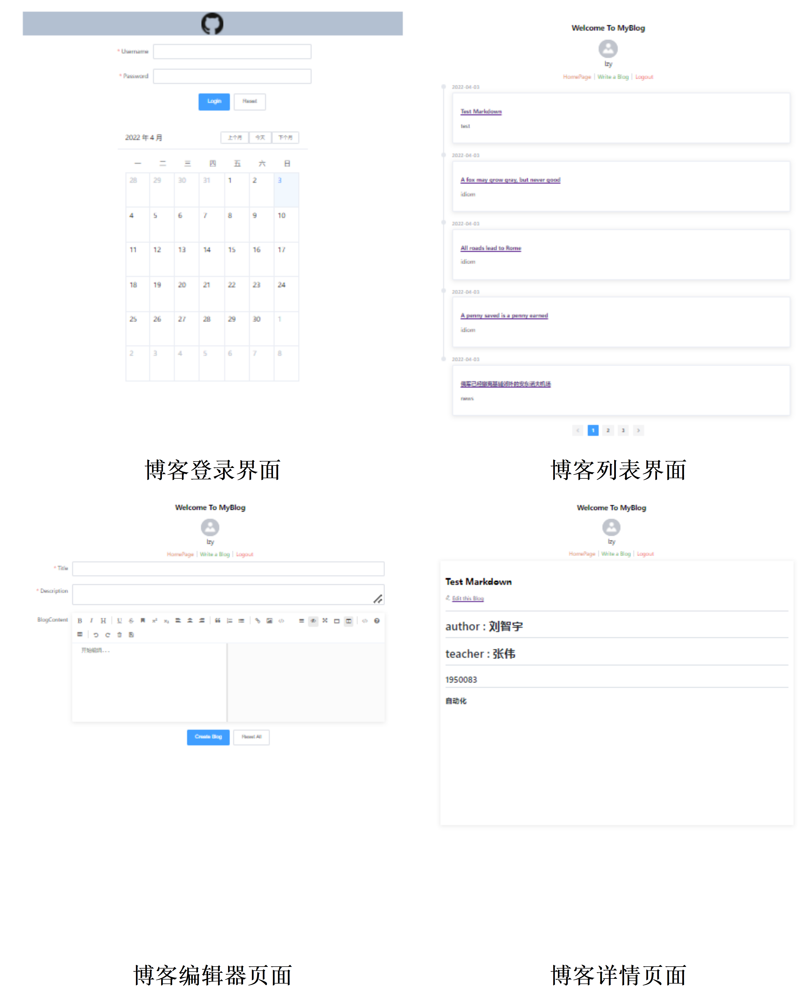

## 项目收获及未来展望

*由于博客开发内容较多，故将项目收获和未来展望提前到此处*

**项目收获**
1. 接触并学习了很多的新技术，如Springboot、Vue、PostgreSQL、Redis、Maven、、Mybatis等，体会到了多个技术之间的串联。
2. 使用了很多工具如Intellij IDEA、PowerDesigner、DBeaver、VSCode等。
4. 对于曾经接触过的技术，本次项目相当于时一次汇总、巩固、提升。
5. 对于从未设计的技术和工具软件，这次项目也开拓了我的视野。
6. 对前后端分离思想有了一个较为初步的印象和理解。本次项目中，先开发后端再开发前端，两个部分基本完全解耦。基本上在进行前端编程时，基本不会对后端代码进行修改。这种思想可以运用到今后的各种大项目之中。
7. 对于面向对象有了更深的理解，今后将多多将该思想运用到其他项目中，进行抽象、解耦。
8. 由于项目工程量较大，在进行代码调试的时候也花费了较多精力，所以对于今后编程的调试也会更加熟练。


**未来展望**
1. 本次项目使用到的数据库结构较为简单，今后可以进一步尝试更加复杂的数据库的结构，同时对于数据库自身的很多知识点还不是很了解，日后会继续研读《DDIA》。
2. 对于本次项目涉及到的前端和后端技术，仅仅做到了基本使用，完成功能，还有很多高级用法和特性没有接触，这些是今后学习的一大方向。
3. 本次项目只是完成了老师布置的基本需求和一个扩展的选做需求，在浏览其他博客的时候，见识到了很多高级的内容
4. 只是学习了整体开发流程，不够熟练，想要从头开始独立开发还是十分困难的，今后有机会还是需要多多练习，熟能生巧。
5. 对于Vue等前端技术还需要继续学习，本次博客项目前端较为简陋，用户体验一般。需要更加精美的前端，

**致谢**
1. 感谢张伟老师、余有灵老师、龚炜助教，在我遇到问题时进行耐心的解答，以及上课时传授的对于数据工程方面的知识。
2. 感谢B站up主MarkerHub老师，本次项目是通过学习MarkerHub老师在B站上的教学视频而，从无到有一步步学习，手敲代码完成的。
3. 感谢B站up主狂神、老杜、宋红康，对于java、sql、JDBC、spirngboot、maven、mybatis、Vue等相关技术的教学。
4. 感谢QQ交流群的各位群友对于我的帮助。


<br>
<br>

## 技术栈

==**技术栈、工具汇总**==
1. **后端**
   1. **技术**
      1. Springboot
      2. Maven
      3. JDBC
      4. PostgreSQL
      5. Redis
      6. Mybatis
      7. Mybatis Plus
      8. JWT
      9. Shiro
   2. **工具**
      1. Intellij IDEA
      2. pgAdmin4
      3. DBeaver
      4. Postman
      5. PowerDesigner

2. **前端**
   1. **技术**
      1. vue
      2. element-ui
      3. axios
      4. mavon-editor
      5. markdown-it
      6. github-markdown-css
   2. **工具**
      1. Intellij IDEA
      2. VSCode（主要用于学习vue、js等，实际开发时还是使用IDEA）
      3. Edge（主要是控制台，即开发人员工具）

## 后端

### 开发环境 & 测试环境


### 创建项目

使用Intellij的Spring Initializer进行创建项目。

这里建议不要选择PostgreSQL，后续可以手动添加依赖，方便进行版本管理。

**配置application.yml**（系统默认为.properties文件，我自己修改了后缀）


### 数据库

使用PowerDesigner工具进行数据库中表的设计。由于我下载的该软件版本较老，并不支持直接生成PostgreSQL14的代码，所以该软件主要是用于辅助表的设计。最终在创建表的时候需要对其生成的SQL进行修改。

**Physical Diagram**

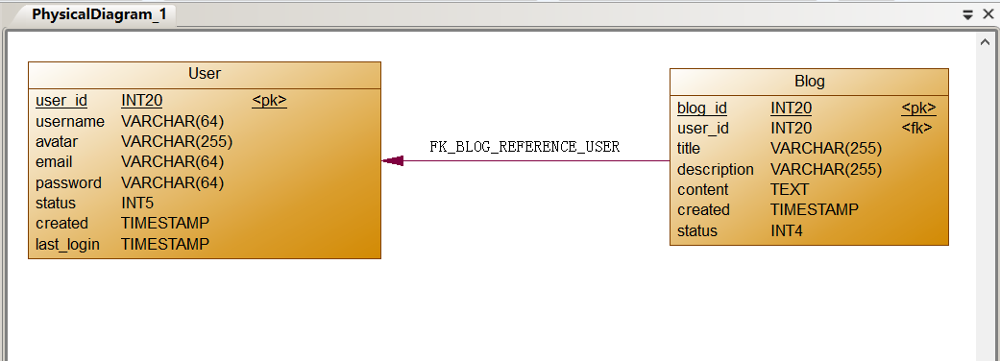

**表的具体列（后续经过调整）**

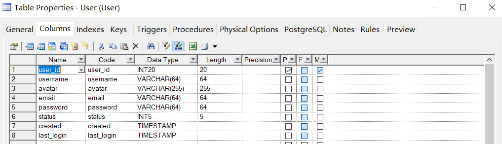

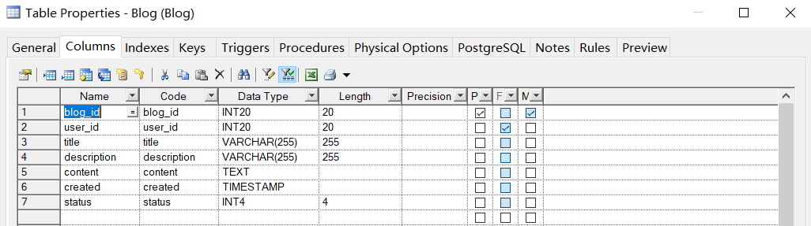

**外键约束**

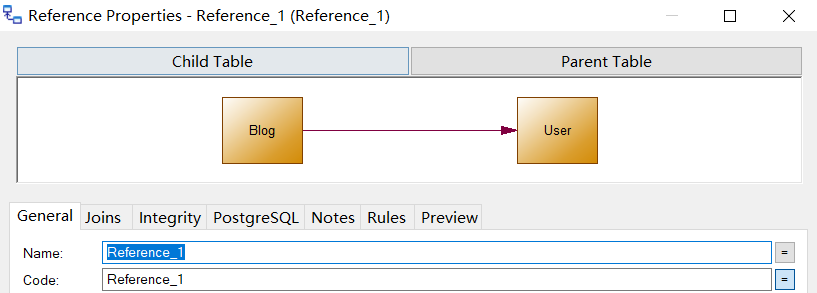

**经过修改后的拆昂加代码**

```sql
create table blogschema.blogs (
   blog_id              bigint               not null,
   user_id              bigint               null,
   title                VARCHAR(255)         null,
   description          VARCHAR(255)         null,
   blog_content         TEXT                 null,
   created              TIMESTAMP            null,
   status               INTEGER              null,
   constraint PK_BLOGSCHEMA_BLOGS primary key (blog_id)
);


create table blogschema.users (
   user_id              bigint               not null,
   username             VARCHAR(64)          null,
   avatar               VARCHAR(255)         null,
   email                VARCHAR(64)          null,
   user_password        VARCHAR(64)          null,
   status               bigint               null,
   created              TIMESTAMP            null,
   last_login           TIMESTAMP            null,
   constraint PK_BLOGSCHEMA_USERS primary key (user_id)
);

alter table blogschema.blogs
   add constraint FK_BLOGSCHE_REFERENCE_BLOGSCHE foreign key (user_id)
      references blogschema.users (user_id)
      on delete restrict on update restrict;
```

**注意**：这里只是建立了一个较为初步的表，后面会进行功能添加，主键约束等等。


**实际创建**


使用DBeaver工具进行可视化创建（当然也可以使用pgAdmin4进行管理，但是之前学习MySQL的时候习惯了DBeaver，故最后还是选择了DBeaver）。为了方便管理，新创建了一个数据库==blogdatabase==，以及一个==blogschema==（如下图所示）。

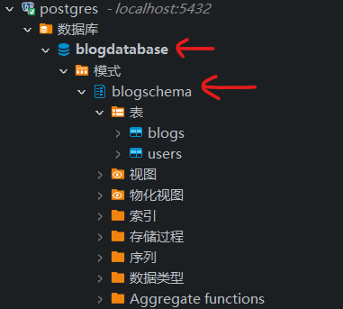

随后将前面的修改后的sql文件在DBeaver中的SQL编辑器中进行创建（*注意创建编辑器时要选对应的数据库*）。创建后可以查看其E-R图。

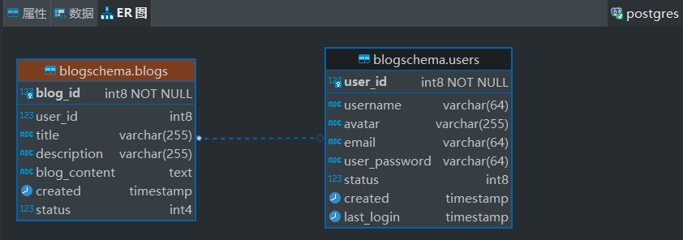

再此导入一些数据方便后续测试

```sql
INSERT INTO blogschema.users 
(user_id,username,avatar,email,user_password,status,created,last_login) 
VALUES 
(0, 'root', 'localhost', 'lzy@gmail.com','root', 
0, '2001-04-09 00:00:00', '2001-04-09 00:00:00');

INSERT INTO blogschema.users 
(user_id,username,avatar,email,user_password,status,created,last_login) 
VALUES 
(1, 'helloworld', 'helloworld','hello@world.com','helloworld', 
0, '2022-03-31 22:02:00', '2022-03-31 22:02:00');

INSERT INTO blogschema.blogs 
(blog_id,user_id,title,description,blog_content,created,status)
VALUES
(0, 0, 'TEST','test','Just a simple test.','2001-04-09 00:00:00',1);
```

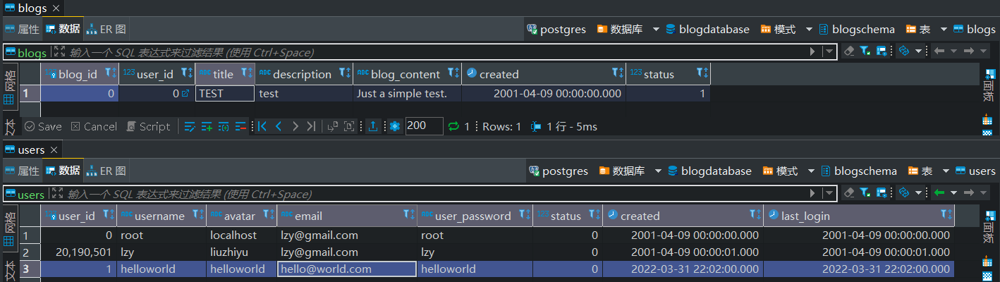

**JDBC测试**
由于不太熟练，所以在使用Mybatis-Plus之前先使用JDBC进行测试。

在pom.xml中导入PostgreSQL的JDBC Driver依赖（后续也会有使用的地方）

```xml
<dependency>
    <groupId>org.postgresql</groupId>
    <artifactId>postgresql</artifactId>
    <version>42.3.3</version>
</dependency>
```

测试代码（精简版，具体见源码）

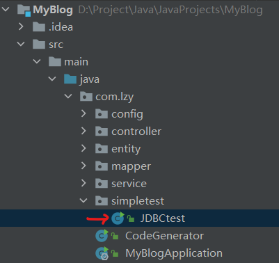

```java
public static void main(String[] args)
{
    Connection connection = null;
    Statement statement = null;
    try
    {
        java.sql.Driver driver = new org.postgresql.Driver();
        DriverManager.registerDriver(driver);
        String dburl = "jdbc:postgresql://127.0.0.1:5432/blogdatabase";
        String dbuser = "postgres";
        String dbpassword = "Lzy010409";
        connection = DriverManager.getConnection(dburl, dbuser, dbpassword);
        System.out.println("数据库连接对象 = " + connection);
        statement = connection.createStatement();
        String sql = new String("select * from blogschema.users;");
        // String sql1 = "select * from blogschema.users;";
        //得到输出结果，测试成功，与数据库连接成功
        ResultSet resultset = statement.executeQuery(sql);
        // ResultSet resultset1 = statement.executeQuery(sql1);
        while(resultset.next())
        {
            String user_id = resultset.getString("user_id");
            String user_name = resultset.getString("username");
            String user_password = resultset.getString("user_password");
            System.out.println("user_id:"+user_id+" - "+"user_name:"+user_name+" - "+"user_password:"+user_password);
        }
    }
    catch(SQLException throwables)
    {
        throwables.printStackTrace();
    }
    finally
    {
        //释放资源，限于篇幅不再赘述
        //statement.close();connection.close();
    }
}
```
输出结果
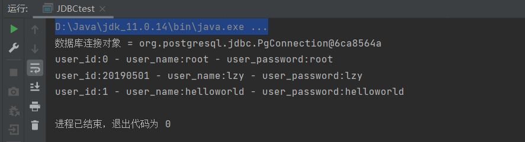

由输出可见，与数据库连接成功


### 整合MybatisPlus

<!--  -->

[MybatisPlus 官网首页](https://baomidou.com/)

**添加依赖**
```xml
<!--集成freemarker模板引擎，后续MybatisPlus代码生成器后续会使用-->
<dependency>
    <groupId>org.springframework.boot</groupId>
    <artifactId>spring-boot-starter-freemarker</artifactId>
</dependency>
<!--MybatisPlus依赖-->
<dependency>
    <groupId>com.baomidou</groupId>
    <artifactId>mybatis-plus-boot-starter</artifactId>
    <version>3.2.0</version>
</dependency>
<dependency><!--MybatisPlus代码生成器-->
    <groupId>com.baomidou</groupId>
    <artifactId>mybatis-plus-generator</artifactId>
    <version>3.2.0</version>
</dependency>
```

**MybatisPlus配置文件**
添加依赖后还需要进行配置
```java
@Configuration
@EnableTransactionManagement
@MapperScan("com.lzy.mapper")
public class MybatisPlusConfig {
    @Bean
    public PaginationInterceptor paginationInterceptor() {
        PaginationInterceptor paginationInterceptor = new PaginationInterceptor();
        return paginationInterceptor;
    }
}
```

**代码生成器**

使用了代码生成器（旧版），需要添加相关依赖。（代码生成器内容较多，主要是在MybatisPlus官网的基础上略作调整，具体代码见源码，**代码生成器文件对应下图中的CodeGenerator.java**）

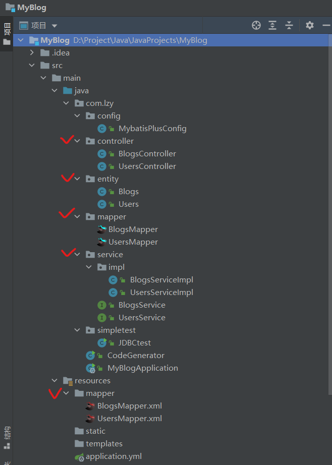

*上图中红色标记的软件包均为由MybatisPlus的代码生成器生成的模板文件，后续需要对这些文件稍作修改*

**对Blogs.java和Users.java进行修改**

在实际使用中，MybatisPlus的代码生成器似乎并没有在entity中添加 ==@TableName== 和 ==@TableId==这两个注解。所以我后续进行了手动添加。（添加位置参考下图）。另外需注意，@TableName注解中需要写明**schema**，否则即时在代码生成器中配置了schema也无济于事。（*具体原因有待学习*）

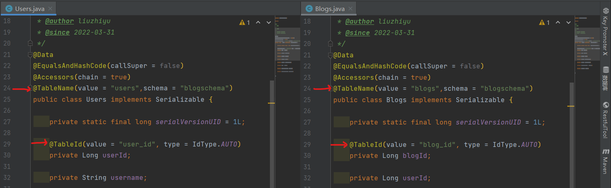

**编写测试Controller**

```java
// UsersController
@RestController
@RequestMapping("/users")
public class UsersController {
    @Autowired
    UsersService usersService;

    @GetMapping("/{user_id}")
    public Object index(@PathVariable("user_id") Long user_id)
    {
        return usersService.getById(user_id);
    }
}
```

```java
// BlogsController
@RestController
@RequestMapping("/blogs")
public class BlogsController {
    @Autowired
    BlogsService blogsService;

    @GetMapping("/{blog_id}")
    public Object index(@PathVariable("blog_id") Long blog_id)
    {
        return blogsService.getById(blog_id);
    }
}
```

测试结果如下，可见成功返回数据库相关信息，可见MybatisPlus整合成功

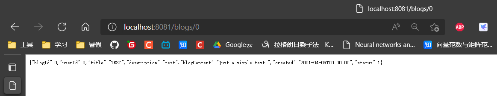

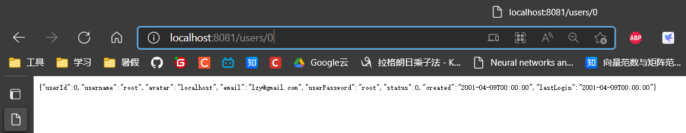


### 统一结果封装

由于项目为前后端分离，所以最好在后端返回数据给前端时能够有一个统一的格式，对接较为方便。我的后端返回结果由以下三部分组成
1. **消息码**(code)：200（成功）、非200（异常）
2. **结果消息**(msg)：账号密码错误等消息
3. **结果数据**(data)：返回相关数据给前端

对应代码中的Result类（在*com.lzy.common.lang*软件包中）
```java
private int code;  // 200表示正常，非200表示异常情况
private String msg;
private Object data;
```

具体java类，及其结构如下图所示（结构中没有将Getters&Setters等由lombok的@Data注解自动生成的方法进行展示）
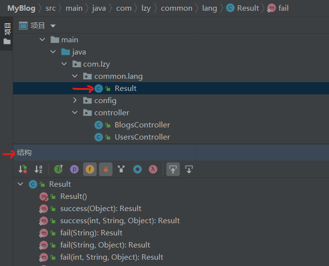


**测试**

修改UsersController.java类并进行测试

```java
@RestController
@RequestMapping("/users")
public class UsersController {
    @Autowired
    UsersService usersService;

    @GetMapping("/{user_id}")
    public Object index(@PathVariable("user_id") Long user_id)
    {
        Users user = usersService.getById(user_id);
        return Result.success(user);
    }
}
```

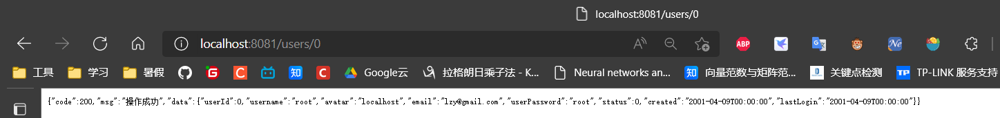

测试成功（这里仅验证了user的success。blog、fail等情况类似）

### 整合Shiro+jwt和会话共享

#### 业务逻辑分析

**用户登录逻辑**
1. 用户使用用户名、密码进行登录
2. 后端校验用户名、密码是否正确
   1. 如果用户信息正确，生成 **Json web token (JWT)** 作为用户身份凭证，返回给用户（用户访问后端资源、接口时均需要携带jwt（身份凭证））
   2. 如果用户信息错误或异常，**抛出异常**

**用户访问后端逻辑**
1. 先经过jwtfilter处理jwt
   1. 有jwt（进行了登录操作），交给shiro进行登录处理（解析jwt）
      1. jwt异常（过期、错误等情况），抛出异常。全局异常处理器进行拦截，返回json数据给前端
      2. jwt正常，访问对应接口
   2. 无jwt（没有进行登录操作），和jwt正常相同，访问接口（只是访问权限较低）
2. 访问Controller之前，先使用shiro的注解进行前置拦截（过滤），判断是否有权限进行访问
   1. 有权限，可以进行Controller的访问，进而访问资源
   2. 无权限访问，抛出异常

#### 整合shiro-redis

[shiro-redis Github主页](https://github.com/alexxiyang/shiro-redis/blob/master/docs/README.md#spring-boot-starter)

**添加相关依赖**
导入shiro-redis的starter，jwt的工具包，以及hutool工具依赖

```xml
<!--shiro-redis-spring-boot-starter-->
<dependency>
    <groupId>org.crazycake</groupId>
    <artifactId>shiro-redis-spring-boot-starter</artifactId>
    <version>3.2.1</version>
</dependency>
<!--hutool工具类-->
<dependency>
    <groupId>cn.hutool</groupId>
    <artifactId>hutool-all</artifactId>
    <version>5.3.3</version>
</dependency>
<!--jwt-->
<dependency>
    <groupId>io.jsonwebtoken</groupId>
    <artifactId>jjwt</artifactId>
    <version>0.9.1</version>
</dependency>
```

**编写配置**

另外，根据shiro-redis在Github上的说明，我们需要自定义Realm，并重写SessionManager、SessionsSecurityManager。

新创建的java类如下（*Realm定义在shiro软件包下的AccountRealm中，重写的manager在config软件包下的ShiroConfig中*）

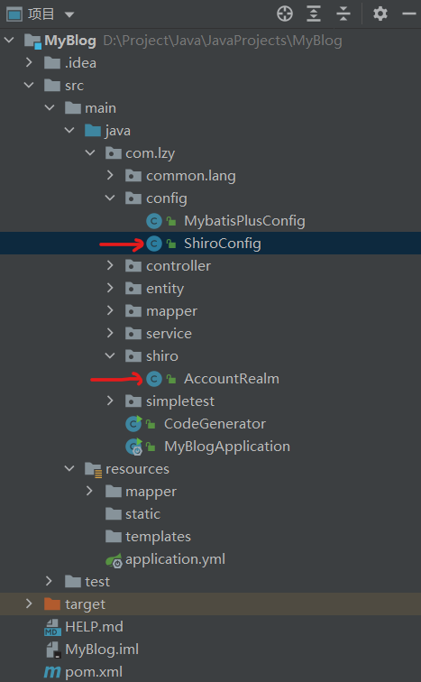

```java
@Configuration
public class ShiroConfig
{
    @Bean
    public SessionManager sessionManager(RedisSessionDAO redisSessionDAO)
    {
        DefaultWebSessionManager sessionManager = new DefaultWebSessionManager();
        // inject redisSessionDAO
        sessionManager.setSessionDAO(redisSessionDAO);
        // other stuff...
        return sessionManager;
    }

    @Bean
    public SessionsSecurityManager securityManager(AccountRealm accountRealm,
                                                   SessionManager sessionManager,
                                                   RedisCacheManager redisCacheManager)
    {
        DefaultWebSecurityManager securityManager = new DefaultWebSecurityManager(accountRealm);
        //inject sessionManager
        securityManager.setSessionManager(sessionManager);
        // inject redisCacheManager
        securityManager.setCacheManager(redisCacheManager);
        // other stuff...
        return securityManager;
    }
}
```

```java
@Component
public class AccountRealm extends AuthorizingRealm
{
    @Override
    protected AuthorizationInfo doGetAuthorizationInfo(PrincipalCollection principalCollection)
    {
        return null;
    }

    @Override
    protected AuthenticationInfo doGetAuthenticationInfo(AuthenticationToken authenticationToken) throws AuthenticationException
    {
        return null;
    }
}
```

按照shiro-redis网页的指导进行修改后，仍有报错

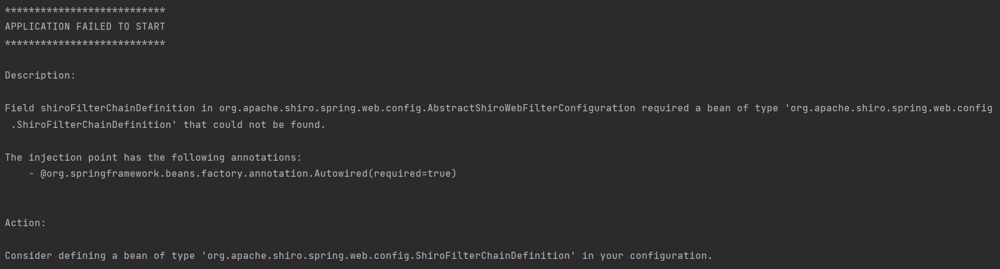

根据错误信息，可以发现是我们需要一个**ShiroFilterChainDefinition**

所以在ShiroConfig中添加**shiro过滤器链定义**

```java
// shiro过滤器链定义
@Bean
public ShiroFilterChainDefinition shiroFilterChainDefinition()
{
    DefaultShiroFilterChainDefinition chainDefinition = new DefaultShiroFilterChainDefinition();

    Map<String, String> filterMap = new LinkedHashMap<>();

    filterMap.put("/**", "authc");  // "authc"过滤器是shiro内置的（需要登录才能进行访问） 主要通过注解方式验证校验
    chainDefinition.addPathDefinitions(filterMap);
    return chainDefinition;
}
```

此时程序可以运行，但是会返回error，错误状态为500

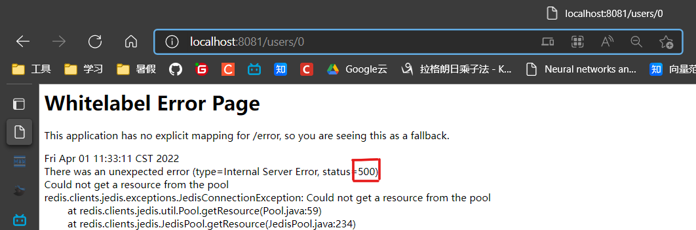

原因是**没有安装redis**，安装完redis并**启动**后，结果如下图。（可以看到错误状态变为404，而相应的url，也相应的变化了（*原因是在shiro过滤器链定义中我们使用的是shiro内置的authc过滤器，需要登录才能访问，所以跳转到默认的login.jsp页面*，所以返回error））后续的开发同样需要借助redis-server。

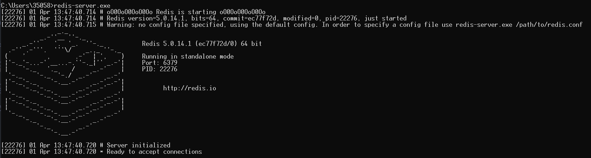


由于要进行前后端分离，所以不应返回jsp，而是返回json数据给前端（经过之前所编写的Result类的封装）。所以需要重写**ShiroFilterChainDefinition**（将之前的代码块中的authc替换为jwt，并添加两个@Bean）

```java
// shiro过滤器链定义
@Bean
public ShiroFilterChainDefinition shiroFilterChainDefinition()
{
    DefaultShiroFilterChainDefinition chainDefinition = new DefaultShiroFilterChainDefinition();

    Map<String, String> filterMap = new LinkedHashMap<>();

    filterMap.put("/**", "jwt");  // 主要通过注解方式验证校验
    chainDefinition.addPathDefinitions(filterMap);
    return chainDefinition;
}


@Autowired
JwtFilter jwtFilter;

@Bean("shiroFilterFactoryBean")
public ShiroFilterFactoryBean shiroFilterFactoryBean(SecurityManager securityManager,
                                                        ShiroFilterChainDefinition shiroFilterChainDefinition)
{
    ShiroFilterFactoryBean shiroFilter = new ShiroFilterFactoryBean();
    shiroFilter.setSecurityManager(securityManager);

    Map<String, Filter> filters = new HashMap<>();
    filters.put("jwt", jwtFilter);
    shiroFilter.setFilters(filters);

    Map<String, String> filterMap = shiroFilterChainDefinition.getFilterChainMap();

    shiroFilter.setFilterChainDefinitionMap(filterMap);
    return shiroFilter;
}
```

另外需要在shiro软件包下创建JwtFilter类。这个过滤器类是重点，这里我继承的是Shiro内置的AuthenticatingFilter，一个可以内置了可以自动登录方法的的过滤器，需要重写方法。

由于涉及到的代码较多，所以这里不做展示，可以在源码中进行查看

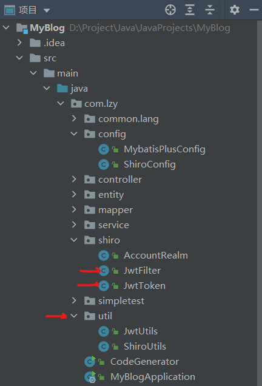


之后还需要在application.yml中添加配置
```yml
lzy:
  jwt:
    secret: f4e2e52034348f86b67cde581c0f9eb5
    # 有效期7天
    expire: 604800
    header: Authorization

shiro-redis:
  enabled: true
  redis-manager:
    host: 127.0.0.1:6379
```

根据Gitbub官方说明，由于添加了spring-boot-devtools依赖，所以还需要额外创建一个文件夹（否则热启动的时候可能会报异常）

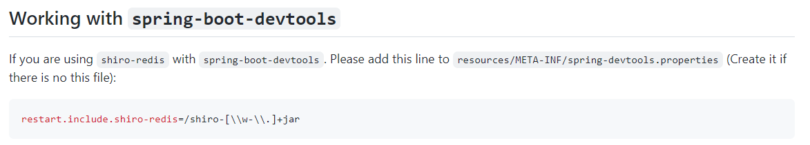

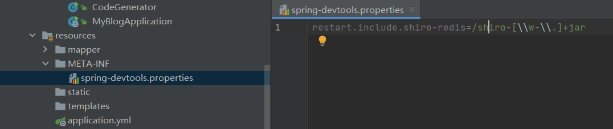


**shiro登录逻辑开发**

在AccountRealm文件中重写方法
```java
@Override
protected AuthenticationInfo doGetAuthenticationInfo(AuthenticationToken authenticationToken)
        throws AuthenticationException
{
    JwtToken jwtToken = (JwtToken) authenticationToken;
    // 进行强制类型转换
    String userId = jwtUtils.getClaimByToken((String) jwtToken.getPrincipal()).getSubject();
    Users users = usersService.getById(Long.valueOf(userId));

    if (users == null)  // 用户不存在，抛出异常
    {
        throw new UnknownAccountException("账户不存在");
    }

    if (users.getStatus() == -1)  // 用户被锁定，抛出异常
    {
        throw new LockedAccountException("账户已被锁定");
    }

    AccountProfile profile = new AccountProfile();
    BeanUtil.copyProperties(users, profile);

    return new SimpleAuthenticationInfo(profile, jwtToken.getCredentials(), getName());
}
```

另外需要新创建一个AccountProfile的java类。从Users类中抽取出一些可公开的、不那么重要的属性进行封装。
```java
@Data
public class AccountProfile implements Serializable
{
    private Long userId;
    private String username;
    private String avatar;
    private String email;
}
```

这里在之前测试后端的是否发现了一个问题，关于shiro-redis，我们需要给AccountProfile新写一个getId方法，本质上和@Data注解创建的getUserId方法相同，但是shiro-redis似乎找不到getUserId方法，处于无奈只能额外写一个getId方法。

```java
public Long getId()
{
    return userId;
}
```

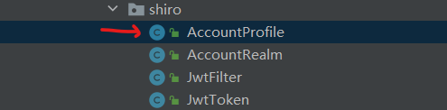

### 异常处理

正如张伟老师上课所说和DDIA一书中所写的一样，异常处处存在，所以异常处理机制显得十分关键。

**全局异常处理**

需要在exception软件包下，新建一个GlobalExceptionHandler的java类，进行全局异常处理

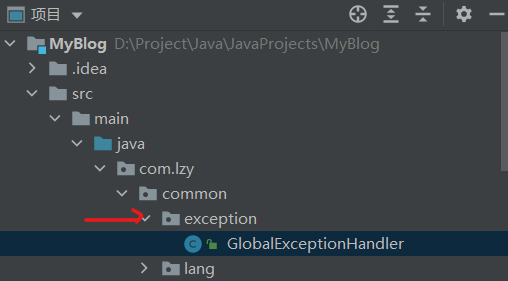

需要对shiro、runtime等异常进行处理。同时进行日志输出

```java
@Slf4j
@RestControllerAdvice
public class GlobalExceptionHandler
{
    // 捕获shiro异常
    @ResponseStatus(HttpStatus.UNAUTHORIZED)
    @ExceptionHandler(value = ShiroException.class)
    public Result handler(ShiroException e)
    {
        log.error("ShiroException:----------------{}", e);
        return Result.fail(401, e.getMessage(), null);
    }


    // 捕获运行时异常
    @ResponseStatus(HttpStatus.BAD_REQUEST)  // 返回状态码
    @ExceptionHandler(value = RuntimeException.class)
    public Result handler(RuntimeException e)
    {
        log.error("RuntimeException:----------------{}", e); // 日志输出
        return Result.fail(e.getMessage());
    }
}
```

可以查看常用的Http状态及其状态码

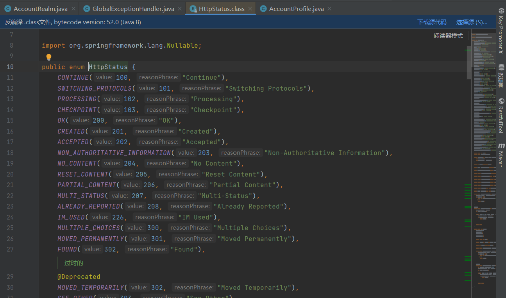

**测试**

修改UsersController，添加 ==@RequiresAuthentication== 注解，表明需要登录。

```java
@RestController
@RequestMapping("/users")
public class UsersController {
    @Autowired
    UsersService usersService;

    @RequiresAuthentication
    @GetMapping("/{user_id}")
    public Object index(@PathVariable("user_id") Long user_id)
    {
        Users user = usersService.getById(user_id);
        return Result.success(user);
    }
}
```

注意：此处测试时也是在开启redis服务器的条件下测试的

**对比测试**：查询用户id为0，第一次没有添加 **@RequiresAuthentication** 注解，第二次添加注解

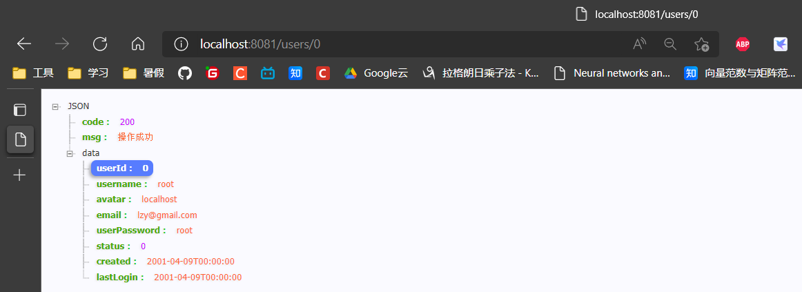

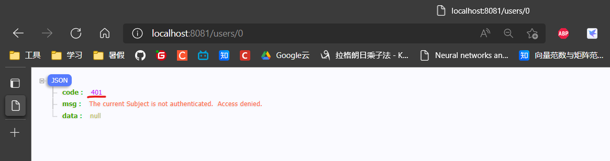

通过上图我们可以看到第一次查询**可以**正常获取用户信息，而第二次查询，添加注解后我们并**不能**像以前一样直接查看用户信息。同时返回错误代码401，表名程序捕获到了捕获shiro异常，测试成功。

*上图结果和原来的黑白不同是我给edge浏览器安装了JSON-handle插件，这样查看json结果较为轻松。在后面的其他中也有所提及。*

### 实体校验

提交form表单的时候，会经历将json数据转换为实体的过程，如果实体中有些字段有具体要求（例如不能为空等）。如果表单body中的json对象要求不能满足，就应该抛出异常，避免进行没有必要的数据处理。

所以我们需要进行实体校验，使用Springboot框架作为基础，就已经自动集成了Hibernate validatior。

具体操作只需要在之前MybatisPlus中自动生成的entitiy软件包下的Users和Blogs类添加一些注解即可，具体如下。

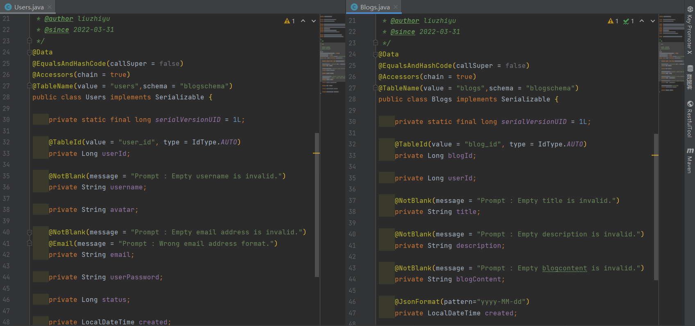

**测试**

需要在UsersController进行添加一个方法

```java
//@Validated    : 校验实体是否满足规则，若不满足则会抛出异常
//@RequestBody  : 转为实体类型
@PostMapping("/verify")
public Result verify(@Validated @RequestBody Users users)
{
    return Result.success(users);
}
```

在GlobalExceptionHandler.java中添加一个异常捕获（用于捕获@validated抛出的异常）
```java
// 实体校验异常
@ResponseStatus(HttpStatus.BAD_REQUEST)
@ExceptionHandler(value = MethodArgumentNotValidException.class)
public Result handler(MethodArgumentNotValidException e)
{
    log.error("MethodArgumentNotValidException:----------------{}", e);
    BindingResult bindingResult = e.getBindingResult();
    ObjectError objectError = bindingResult.getAllErrors().stream().findFirst().get();

    return Result.fail(objectError.getDefaultMessage());
}
```

使用Postman软件进行测试

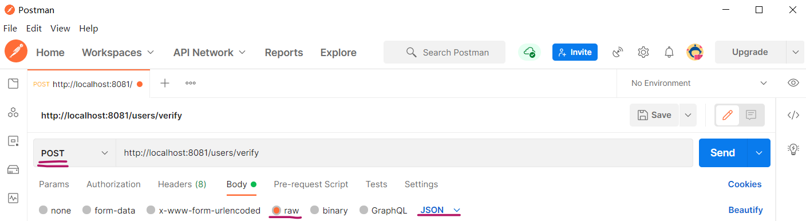

*测试前先将Postman进行如上设置，否则测试结果没有意义*

使用错误信息进行测试
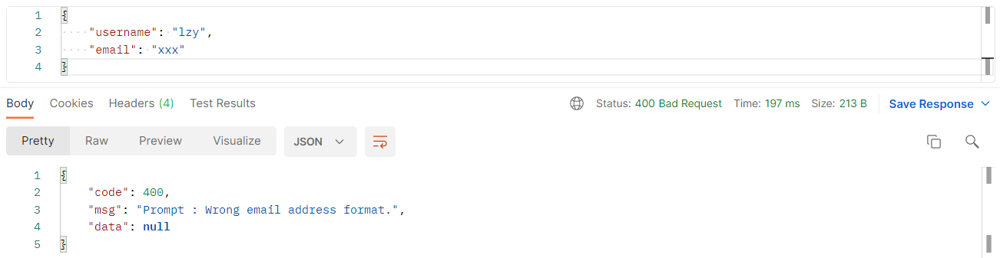

使用空信息进行测试
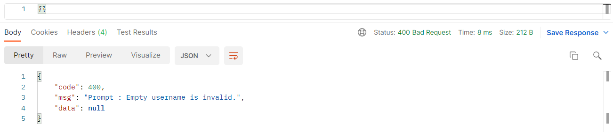

使用正确信息进行测试
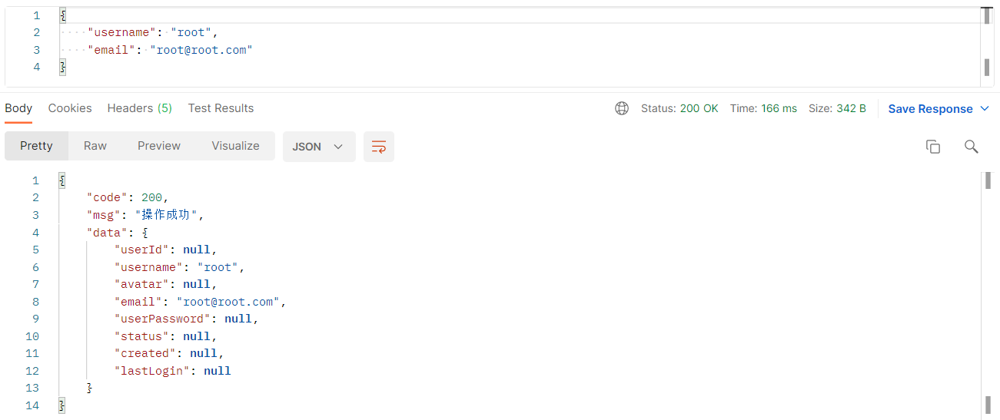

由此可见错误信息和之前的实体检验配置一致，测试成功。


### 解决跨域问题

跨域资源共享(Cross-Origin Resource Sharing)。由于项目采用前后端分离，所以会遇到跨域问题，这里再后端进行全局跨域处理。

这里需要再config软件包下创建CorsConfig类，如下图所示。

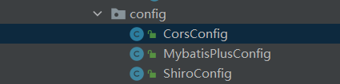

```java
@Configuration
public class CorsConfig implements WebMvcConfigurer
{
    @Override
    public void addCorsMappings(CorsRegistry registry) 
    {
        registry.addMapping("/**")
                .allowedOrigins("*")
                .allowedMethods("GET", "HEAD", "POST", "PUT", "DELETE", "OPTIONS")
                .allowCredentials(true)
                .maxAge(3600)
                .allowedHeaders("*");
    }
}
```

由于上面的跨域是配置在Controller上的，在Controller之前还有JwtFilter（这一点在先前的**用户访问后端逻辑**中也已经提及）。所以，还需要再com.lzy.shiro软件包下的JwtFilter类中添加一个方法preHandle。

```java
@Override
protected boolean preHandle(ServletRequest request, ServletResponse response) throws Exception
{
    HttpServletRequest httpServletRequest = WebUtils.toHttp(request);
    HttpServletResponse httpServletResponse = WebUtils.toHttp(response);
    httpServletResponse.setHeader("Access-control-Allow-Origin", httpServletRequest.getHeader("Origin"));
    httpServletResponse.setHeader("Access-Control-Allow-Methods", "GET,POST,OPTIONS,PUT,DELETE");
    httpServletResponse.setHeader("Access-Control-Allow-Headers", httpServletRequest.getHeader("Access-Control-Request-Headers"));
    // 跨域时会首先发送一个OPTIONS请求，这里我们给OPTIONS请求直接返回正常状态
    if (httpServletRequest.getMethod().equals(RequestMethod.OPTIONS.name()))
    {
        httpServletResponse.setStatus(org.springframework.http.HttpStatus.OK.value());
        return false;
    }

    return super.preHandle(request, response);
}
```


### 接口开发

之前已经将后端项目的骨架完成，后续进行业务接口的开发。

#### 登录接口

登录的逻辑较为简单，接受账号和密码，然后把用户的id生成jwt，返回给前端，为了后续的jwt的延期，所以我们把jwt放在header上。

新建文件及软件包如下：
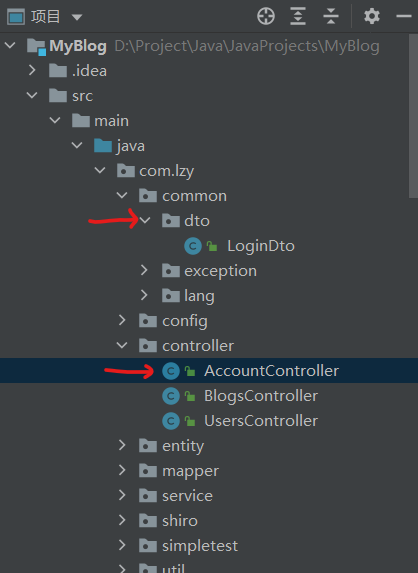

*LoginDto:将用户名和密码从传输的body转为DTO(数据传输对象(Data Transfer Object))*

*AccountController:*


LoginDto类
```java
@Data
public class LoginDto implements Serializable
{
    //记得添加校验
    @NotBlank(message = "Login Prompt : Username can't be empty.")
    private String username;

    @NotBlank(message = "Login Prompt : Password can't be empty.")
    private String password;
}
```

AccountController类（包含了登录Login和退出Logout的方法）
```java
@RestController
public class AccountController
{
    @Autowired
    UsersService usersService;

    @Autowired
    JwtUtils jwtUtils;

    // 登录接口
    @PostMapping("/login")
    // 仍需要通过@Validated进行校验
    public Result login(@Validated @RequestBody LoginDto loginDto, HttpServletResponse response)
    {
        Users users = usersService.getOne(new QueryWrapper<Users>().eq("username", loginDto.getUsername()));
        // 使用断言进行处理（如果异常会抛出异常 IllegalArgumentException）
        Assert.notNull(users, "The user is not exist.");

        //if(!users.getUserPassword().equals(SecureUtil.md5(loginDto.getPassword())))
        if(!users.getUserPassword().equals(loginDto.getPassword()))
        {
            return Result.fail("Wrong password.");
        }
        String jwt = jwtUtils.generateToken(users.getUserId());

        response.setHeader("Authorization", jwt);
        response.setHeader("Access-control-Expose-Headers", "Authorization");
        // 返回map信息
        return Result.success(MapUtil.builder()
                .put("userId", users.getUserId())
                .put("username", users.getUsername())
                .put("avatar", users.getAvatar())
                .put("email", users.getEmail())
                .map()
        );
    }
    
    // 退出接口
    @RequiresAuthentication
    @GetMapping("/logout")
    public Result logout()
    {
        SecurityUtils.getSubject().logout();
        return Result.success(null);
    }
}
```

由于在AccountController中使用了断言，对用户是否存在进行判断，所以需要在全局异常处理中对Assert断言进行异常捕捉。
```java
// Assert异常
@ResponseStatus(HttpStatus.BAD_REQUEST)
@ExceptionHandler(value = IllegalArgumentException.class)
public Result handler(IllegalArgumentException e)
{
    log.error("IllegalArgumentException：----------------{}", e);
    return Result.fail(e.getMessage());
}
```

==**注意**==
由于我使用的jdk版本为11，所以需要**额外添加如下依赖**。（查了好久才找到原因）

在没有添加这些依赖前使用JWT生成TOKEN时发生报错：
*java.lang.ClassNotFoundException: javax.xml.bind.DatatypeConverter*


```xml
<dependency>
    <groupId>javax.xml.bind</groupId>
    <artifactId>jaxb-api</artifactId>
    <version>2.3.0</version>
</dependency>
<dependency>
    <groupId>com.sun.xml.bind</groupId>
    <artifactId>jaxb-impl</artifactId>
    <version>2.3.0</version>
</dependency>
<dependency>
    <groupId>com.sun.xml.bind</groupId>
    <artifactId>jaxb-core</artifactId>
    <version>2.3.0</version>
</dependency>
<dependency>
    <groupId>javax.activation</groupId>
    <artifactId>activation</artifactId>
    <version>1.1.1</version>
</dependency>
```

**测试**
基础配置如下：
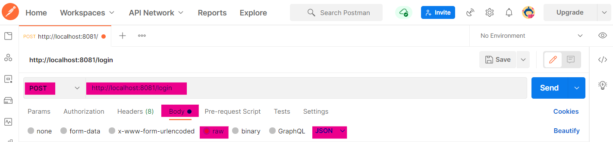

使用正确的用户登录信息
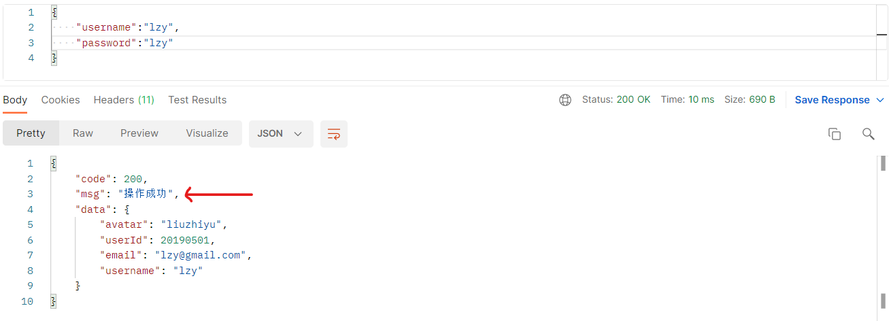

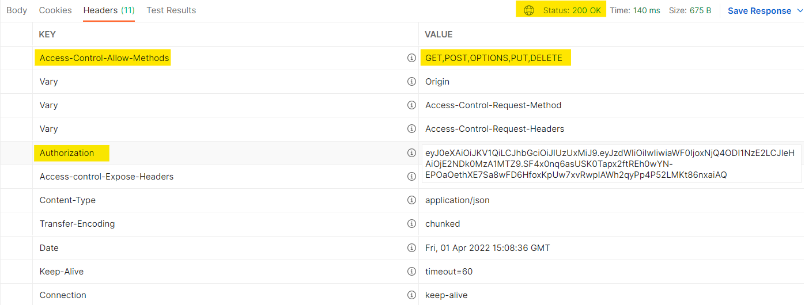

使用错误的用户密码
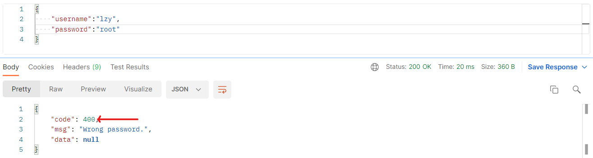

使用不存在的用户
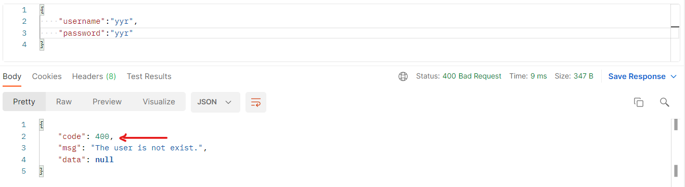

登录接口测试成功


#### 博客接口

为了实现一个博客网站的基本功能，我参考他人的设计给博客设计了3个接口。
1. 博客列表
2. 博客详情
3. 博客编辑器（分为新建和编辑）

在BlogsController中添加三个Controller。

列表Controller
```java
// 列表Controller
@GetMapping("/blogs")
public Result list(@RequestParam(defaultValue = "1") Integer currentPage) // 默认第一页
{
    Page page = new Page(currentPage, 5);  // 一页默认的记录数
    IPage pageData = blogsService.page(page, new QueryWrapper<Blogs>().orderByDesc("created"));

    return Result.success(pageData);
}
```

详情Controller
```java
// 详情Controller
@GetMapping("/blog/{blogId}")
public Result detail(@PathVariable(name = "blogId") Long blogId)
{
    Blogs blogs = blogsService.getById(blogId);
    // 使用断言判断博客是否存在
    Assert.notNull(blogs, "Detail Prompt : This blog does not exist.");

    return Result.success(blogs);
}
```

编辑器Controller
```java
// 编辑器Controller
@RequiresAuthentication  // 需要登录才能编辑
@PostMapping("/blog/editor")
public Result editor(@Validated @RequestBody Blogs blogs)  // 校验传入的参数是否满足要求
{
    // Assert.isTrue(false, "公开版不能任意编辑！");
    Blogs temp = null;
    if(blogs.getUserId() != null)  // 原来的数据库中有该博客，修改博客
    {
        temp = blogsService.getById(blogs.getUserId());
        // 只能编辑自己的文章
        System.out.println(ShiroUtils.getProfile().getUserId());
        Assert.isTrue(temp.getUserId().longValue() ==
                ShiroUtils.getProfile().getUserId().longValue(),
                "Editor Prompt : You don't have the authority to edit this blog.");
    }
    else  // 原来的数据库中没有该博客，新建博客
    {
        temp = new Blogs();
        temp.setUserId(ShiroUtils.getProfile().getUserId());
        temp.setCreated(LocalDateTime.now());
        temp.setStatus(0);
    }

    BeanUtil.copyProperties(blogs, temp, "id", "userId", "created", "status");  // 将旧博客的信息拷贝到新博客
    blogsService.saveOrUpdate(temp);

    return Result.success(200,"The operation is saved",null);
}
```

对数据库进行修改（添加主键递增）
```sql
create sequence blog_id_seq start with 1 increment by 1 no minvalue no maxvalue cache 1;

alter table blogschema.blogs alter column blog_id set default nextval('blog_id_seq');

create sequence user_id_seq start with 1 increment by 1 no minvalue no maxvalue cache 1;

alter table blogschema.users alter column user_id set default nextval('user_id_seq');
```

**测试**

==*测试时开启redis服务器*== （命令行输入：*redis-server.exe*）

测试登录接口
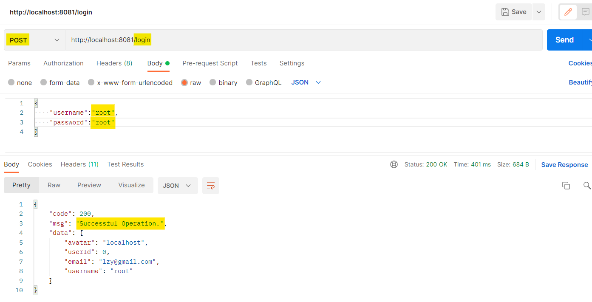
复制Authorization 后面会用到

测试博客列表接口
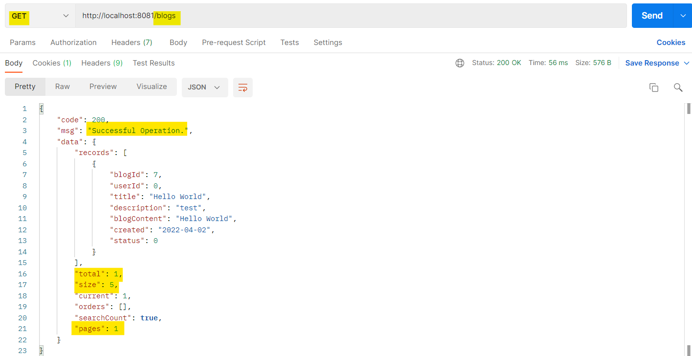
测试博客详情接口
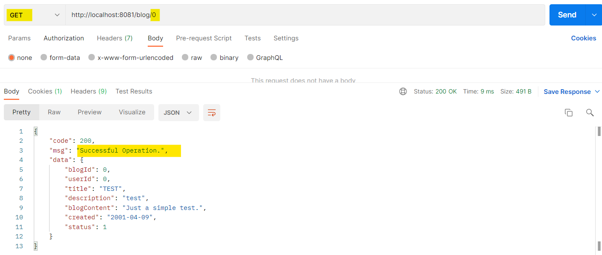
测试编辑器功能（先将数据库清空再进行测试）（记得将之前复制的Authorization复制到Headers中）
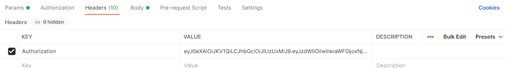
*测试创建博客*
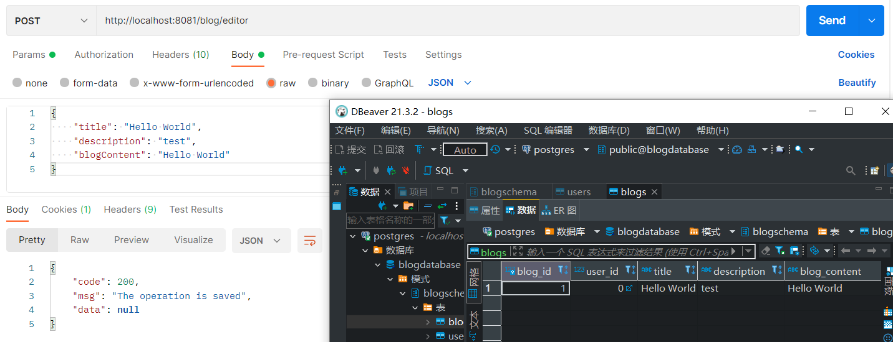
*测试修改博客*
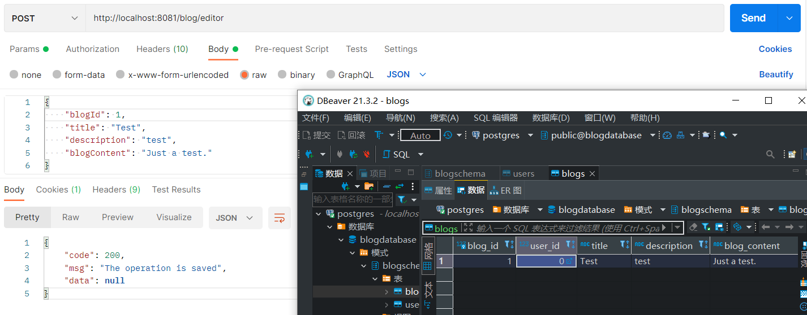

<br>
<br>


## 前端

### 环境安装 & 新建项目

**传送门**

[Vue 2.x 官方教程](https://cn.vuejs.org/v2/guide/installation.html)

[Vue 3.x 官方教程](https://v3.cn.vuejs.org/guide/introduction.html)

**环境安装**
1. 在控制台输入**node -v**、**npm -v**查看相关版本（我的版本如下图所示）
   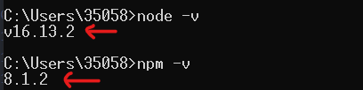
2. 安装淘宝npm，控制台输入：**npm install -g cnpm --registry=https://registry.npm.taobao.org**，cnpm是为了提高我们安装依赖的速度
3. 安装依赖包vue-cli，输入：**cnpm install --g vue-cli**
4. 我在输入上述指令后在控制台输入：**vue ui**并没有反应。输入：**vue -h**，发现commands里面并没有ui的选项
5. 在网上查询后，在控制台输入：==**cnpm i -g @vue/cli**==
6. 再次输入：**vue -h**，可以看到commands有ui的选项。输入：**vue ui**，成功打开vue的可视化管理工具界面
   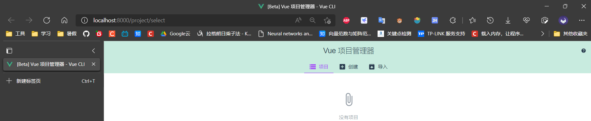
7. 我也安装了yarn，命令行输入：**cnpm install -g yarn**
   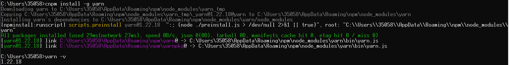


**新建项目**
新建项目时，需要再相应的项目目录下打开命令行输入：**vue ui**
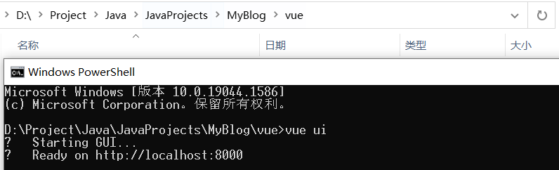

通过Vue的脚手架创建项目
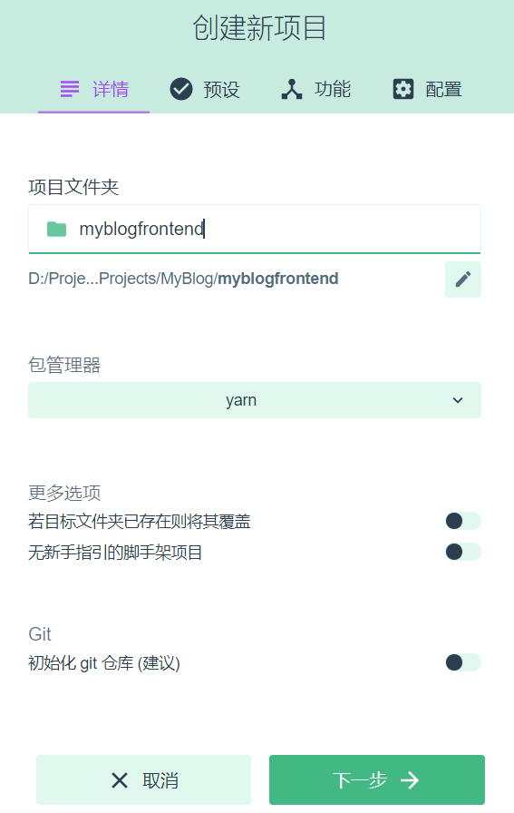
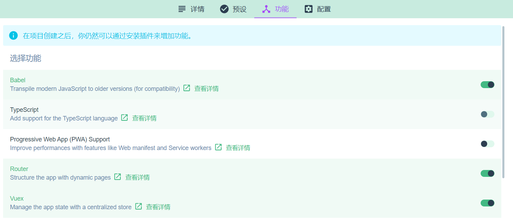
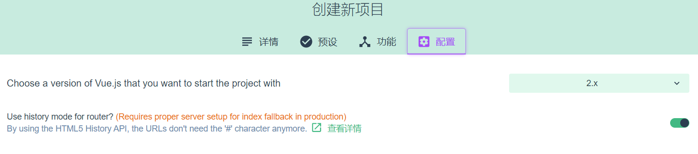
*之前了解到vue3.x和element-ui之间可能有一些小问题，所以这里选用Vue的2.x版本*

**IDEA配置**
*给IDEA安装VUE插件*


*导入项目（将vue ui创建的项目导入）*
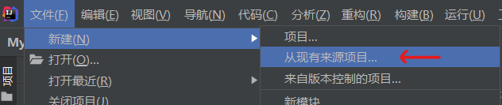

*项目结构*
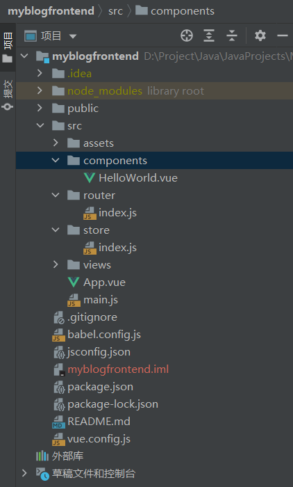
说明
1. components：存放公共资源的组件
2. router：配置路由
3. store：数据状态管理（保证各个组件之间数据的==一致性==）
4. views：需要开发的部分
5. App.vue：是整个项目入口组件

### 安装element-ui & axios

**element**


[Element 官网](https://element.eleme.cn/#/zh-CN)

使用idea安装即可，在项目中的中断输入：**cnpm install element-ui --save** 即可。

随后在main.js中引入
```js
import Element from 'element-ui'
import "element-ui/lib/theme-chalk/index.css"

Vue.use(Element)
```
测试
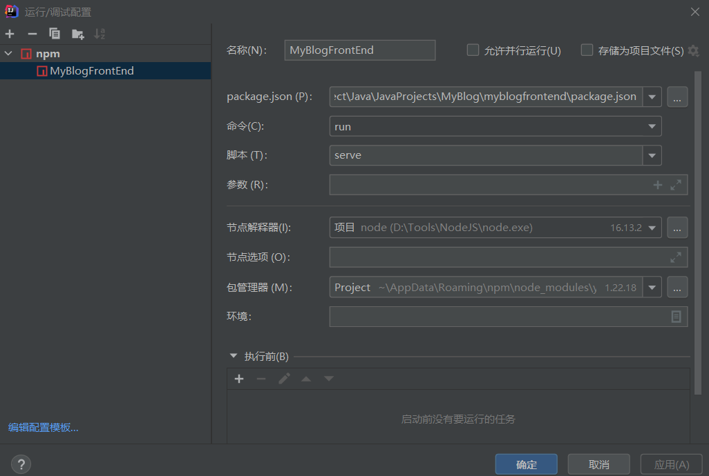

**axios**

命令行输入：**cnpm install axios --save** 即可

随后在main.js中添加两行axios相关命令，最终结果如下：

```js
import Vue from 'vue'
import App from './App.vue'
import router from './router'
import store from './store'
import Element from 'element-ui'
import "element-ui/lib/theme-chalk/index.css"
import axios from 'axios'

Vue.use(Element)
Vue.config.productionTip = false
Vue.prototype.$axios = axios

new Vue({
  router,
  store,
  render: h => h(App)
}).$mount('#app')
```


### 页面路由

由于这个博客项目会使用到的页面并不多，所以这里直接新建几个.vue文件。


在vue文件中随便写入一些内容
```js
<template>
  <div>
    Login
  </div>
</template>

<script>
export default {
  name: "Login"
}
</script>

<style scoped>

</style>
```

配置路由中心：**src/router/index.js**，将创建的.vue文件添加进来


```js
import Vue from 'vue'
import VueRouter from 'vue-router'
// 将vue文件添加进来
import Login from '../views/Login.vue'
import Blogs from '../views/Blogs.vue'
import BlogEditor from '../views/BlogEditor.vue'
import BlogDetail from '../views/BlogDetail.vue'

Vue.use(VueRouter)

const routes = [
  {
    path: '/',
    name: 'Index',
    redirect: {name: "Blogs"}  // 首页重定向，name标签的内容需要加双引号
  },
  {
    path: '/blogs',
    name: 'Blogs',
    component: Blogs
  },
    // 登录博客页面
  {
    path: '/login',
    name: 'Login',
    component: Login
  },
    // 添加博客页面
  {
    path: '/blog/add',
    name: 'BlogAdd',
    component: BlogEditor,
    meta: {
      requireAuth: true
    }
  },
  {
    path: '/blog/:blogId',
    name: 'BlogDetail',
    component: BlogDetail
  },
    // 修改博客页面
  {
    path: '/blog/:blogId/editor',
    name: 'BlogEditor',
    component: BlogEditor,
    meta: {
      requireAuth: true
    }
  }
]

const router = new VueRouter({
  mode: 'history',
  base: process.env.BASE_URL,
  routes
})

export default router
```

**测试**

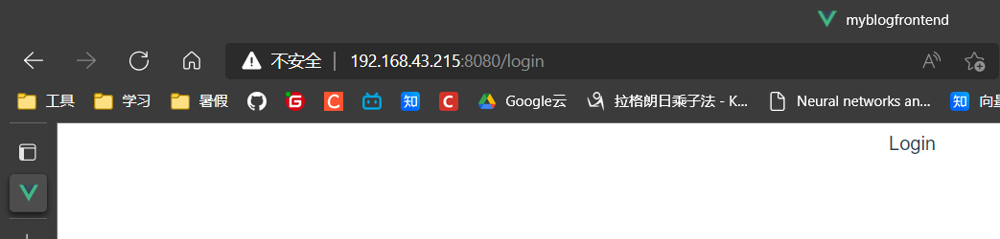

可以看到页面上显示了相关信息，测试成功

### 登录页面开发

**页面布局**

[Element官网 Container布局容器](https://element.eleme.cn/#/zh-CN/component/container)

可以从官网下载一些常见的布局及其样式，使用一个常用的上下布局（header-main）即可。

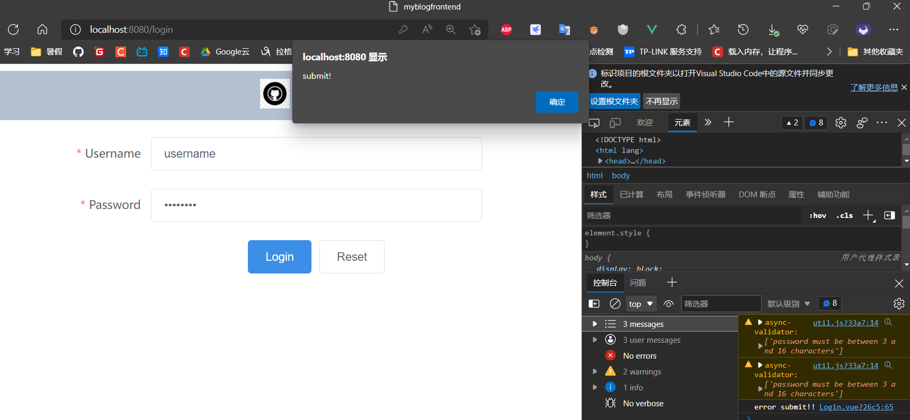

**发起请求**

将表单数据提交给后端，由后端进行用户名和密码的校验。为了方便，使用axios库，编写发起请求的代码（有些时候需要让多个组件共享数据，需要在store/index.js中进行相应配置）。核心代码如下图所示（*非最终版本*）。

Login.vue中
```js
methods: {
    submitForm(formName) {
        this.$refs[formName].validate((valid) => {
        if (valid) {
            alert('submit!');
            this.$axios.post('http://localhost:8081/login',this.ruleForm)
                .then(res=>
                {
                console.log(res.headers)//输出请求头数据（jwt在请求头中）
                console.log(res)//输出全部数据
                }
                )// vue进行双向数据绑定将ruleForm数据拿来即可
        } else {
            console.log('error submit!!');
            return false;
        }
        });
    },
    resetForm(formName) {
        this.$refs[formName].resetFields();
    }
}
```
store/index.js
```js
export default new Vuex.Store({
  state: {
    token: '',
    userInfo: JSON.parse(sessionStorage.getItem("userInfo")),
    // PicsPrefix: '../../FrontendPics/'
  },
  getters: {
    // get
    getUser: state => {
      return state.userInfo
    }
  },
  mutations: {
    // set
    SET_TOKEN: (state, token) => {
      state.token = token
      localStorage.setItem("token", token)
    },
    SET_USERINFO: (state, userInfo) => {
      state.userInfo = userInfo
      sessionStorage.setItem("userInfo", JSON.stringify(userInfo))
    },
    REMOVE_INFO: (state) => {
      state.token = '' //赋值为空
      state.userInfo = {}
      localStorage.setItem("token", '')
      sessionStorage.setItem("userInfo", JSON.stringify(''))
    }
  },
  actions: {
  },
  modules: {
  }
})
```

测试结果如下图（测试时开启前端程序、后端程序、redis-server）
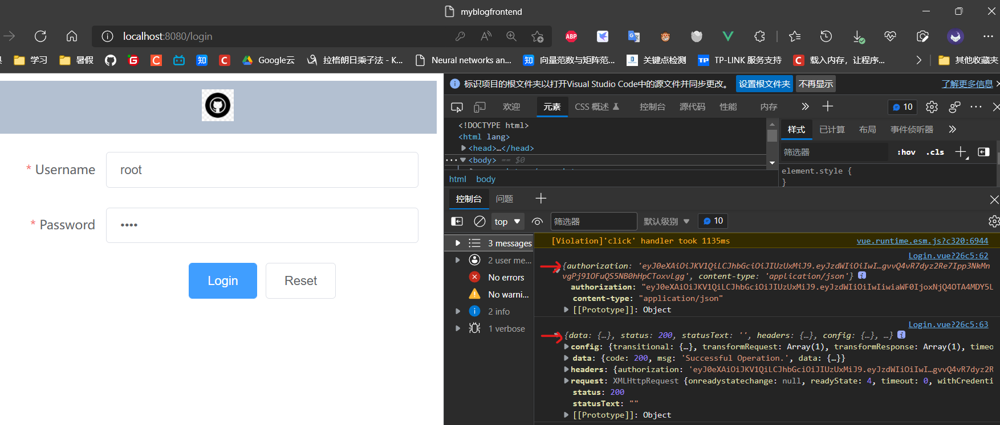
*可以看到当输入正确的用户名(root)和密码(root)，后端返回了相应的authorization和数据，对应上面代码中的res.header和res。从下图也可也看到，相关信息可以被各个组件进行共享*
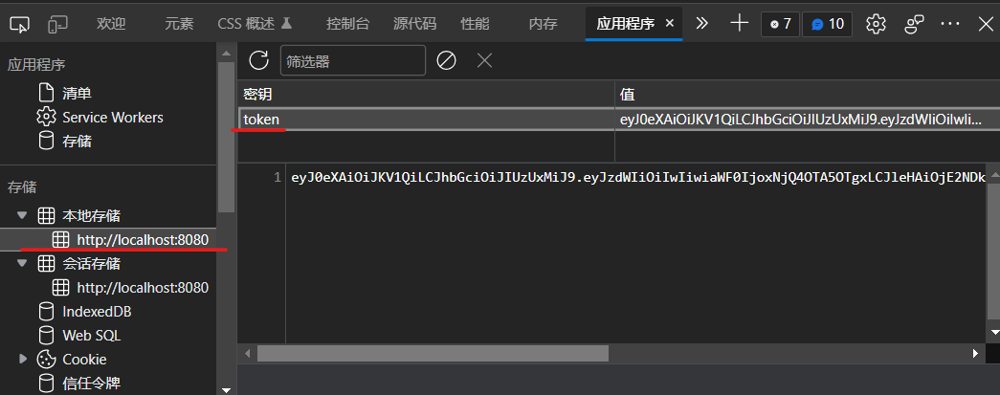
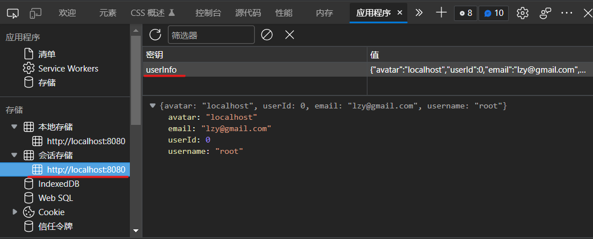

### 配置全局axios拦截

在上次的测试中，验证的是用户名和密码输入正确的情况。并没有处理用户名和密码输入错误的情况（输入错误的结果如下图所示）

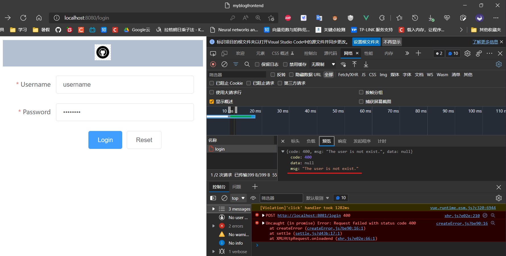

可以看到当用户名和密码不正确时，前端并未任何反馈，只是产生了错误代码和信息，而这些信息是用户看不到的，这样对于用户十分不友好。所以需要在发起请求的结果出现异常时，进行弹窗提示。另外会有很多场合出现异常，所以最好有一个全局异常处理。可以使用axios的前置拦截和后置拦截，在src目录下创建axios.js文件（为了不让main.js过于臃肿），记得在main中进行导入**import "./axios"**。

```js
axios.defaults.baseURL = "http://localhost:8081"
// 会作为前缀添加到url之前

// 前置拦截器，可以添加请求头信息
axios.interceptors.request.use(config => {
  return config
})

// 后置拦截器，出现异常后，弹窗拦截
axios.interceptors.response.use(response => {
    let res = response.data;

    console.log("Response Interceptors")
    console.log(res)  // 输入信息

  },
)
```
*测试前置拦截是否生效（输入正确的用户名和错误的用户密码）*
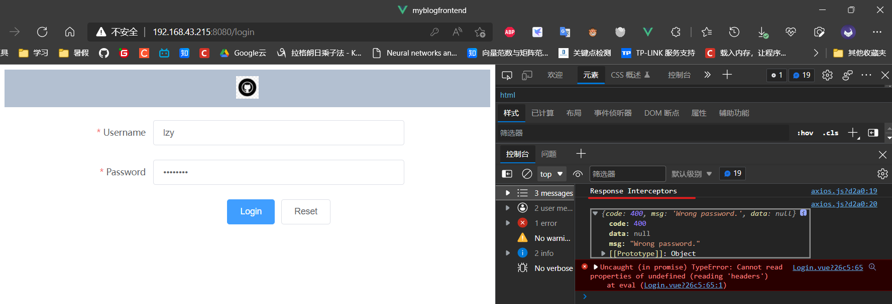

可以使用Element-ui的Message消息提醒，进行弹窗提示。[Element官网 Message例程](https://element.eleme.cn/#/zh-CN/component/message)

在axios.js文件的后缀拦截器中添加一些判断和异常处理
```js
// 后置拦截器，出现异常后，弹窗拦截
axios.interceptors.response.use(response => {
    let res = response.data;
    console.log("Response Interceptors")
    console.log(res)  // 输入信息
    // 对内容进行解析，分支处理
    if (res.code === 200) {
      return response
    } else { // res.code 不等于200 说明存在异常
        // 弹出弹窗，给予用户提示
      Element.Message.error('Wrong password.', {duration: 3 * 1000}) // 添加超时时间3秒
      return Promise.reject(response.data.msg)
    }
  },
  error => {
    console.log(error)
    if(error.response.data) {
      error.message = error.response.data.msg
    }
    if(error.response.status === 401) {  // 出现ShiroException，跳转到登录页面
      store.commit("REMOVE_INFO")
      router.push("/login")
    }
    Element.Message.error(error.message, {duration: 3 * 1000})
    return Promise.reject(error)
  }
)
```

*弹窗测试成功，可以对用户名密码同时错误和用户名正确用户密码错误的情况进行处理（前者的错误信息是从后端产生的）*
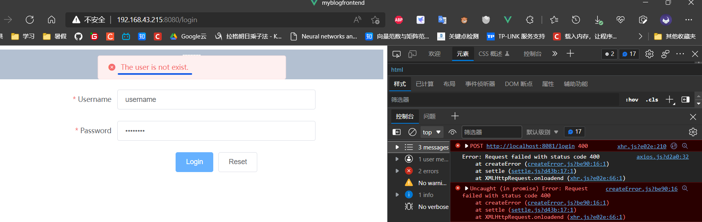
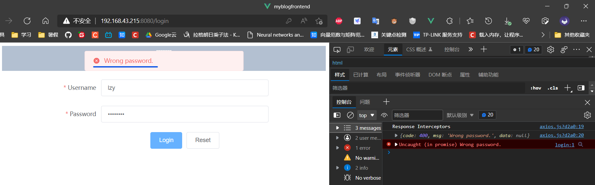


### 博客列表

#### 博客头部开发

博客列表页面为分页数据，分为头部（展示用户登录信息，一些功能按钮），博客内容列表（包含博客内容展示以及分页的页码选择）。由于头部后面会有很多页面公用，所以将其独立抽取出来，作为一个组件。

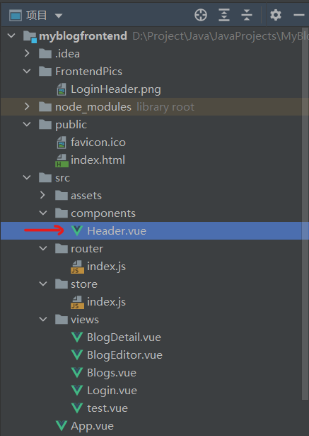

在Blogs中引入Header.vue，会用到的组件
1. [Element官网 头像组件Avatar](https://element.eleme.cn/#/zh-CN/component/avatar)
2. [Element官网 分割线组件Divider](https://element.eleme.cn/#/zh-CN/component/divider)
3. [Element官网 文字链接组件Link](https://element.eleme.cn/#/zh-CN/component/link)


components/Header.vue核心代码，根据是否登录进行不同处理
1. 已登录才能进行查看博客主页、编写博客、退出（退出时需要清除用户信息）
2. 未登录只能进行登录
```js
<script>
  export default {
    name: "Header",
    data() {
      return {
        user: {  // 用户信息
          username: 'Please login first.',
          avatar: 'https://cube.elemecdn.com/3/7c/3ea6beec64369c2642b92c6726f1epng.png'
        },
        hasLogin: false
      }
    },
    methods: {
      // 退出需要先登录，所以需要将token信息传递
      logout() {
        const _this = this
        _this.$axios.get("/logout", {
          headers: {
            "Authorization": localStorage.getItem("token")  // 通过localstorage获取token
          }
        }).then(res => {
          _this.$store.commit("REMOVE_INFO")  // 调用REMOVE_INFO方法清除信息
          _this.$router.push("/login")  // 退出后切换到登录页面
        })
      }
    },
    created() {
      // 信息回显
      if(this.$store.getters.getUser.username) {
        this.user.username = this.$store.getters.getUser.username
        this.user.avatar = this.$store.getters.getUser.avatar
        this.hasLogin = true  // 表名登录成功
      }
    }
  }
</script>
```

测试（*上图为登录后显示的界面，下图为为登录显示的界面*，点击login和logout分别会进行跳转到登录页面）
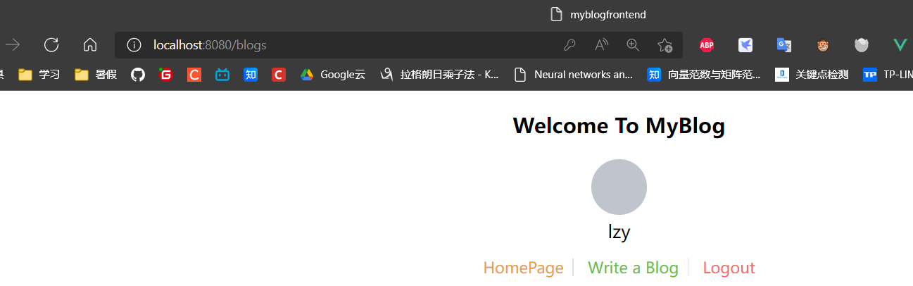
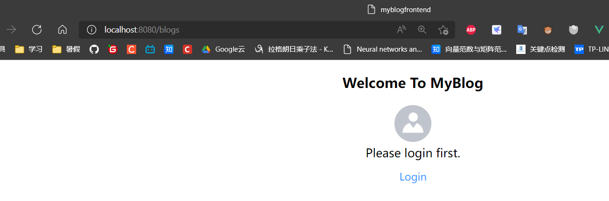

#### 博客列表开发

用到了Element组件
1. [Element官网 时间线组件Timeline](https://element.eleme.cn/#/zh-CN/component/timeline)
2. [Element官网 分页组件Pagination](https://element.eleme.cn/#/zh-CN/component/pagination)


*需要注意的是，data下的records中存放的才是各篇博客的具体信息，这一点要小心*
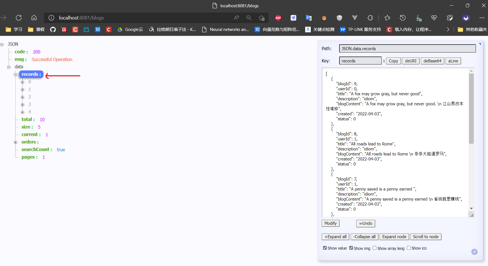

这里仅展示methods中的方法，template内容主要参考Element官方教程
```java
methods: { // 数据展示需要进行请求
  page(currentPage) {
    const _this = this
    _this.$axios.get("/blogs?currentPage=" + currentPage).then(res => {  // 添加当前页码
      console.log(res)

      _this.blogs = res.data.data.records  // 注意：data中的records才是博客信息
      _this.currentPage = res.data.data.current
      _this.total = res.data.data.total
      _this.pageSize = res.data.data.size
    })
  }
},
// 在页面渲染时进行调用
created() {
  this.page(1)
}
```

*博客主页最终效果*
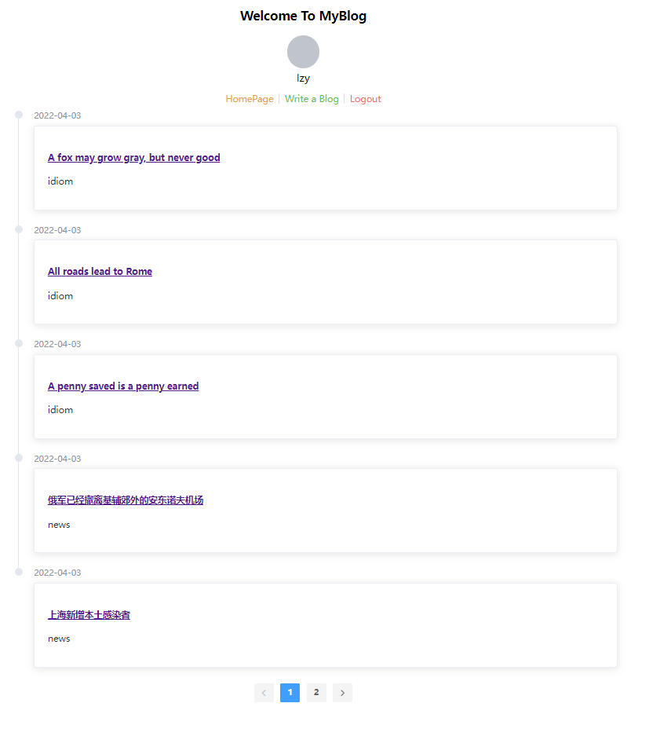


#### 博客编辑器开发

添加一个markdown编辑器：mavon-editor，在命令行输入：**cnpm install mavon-editor --save**，然后再main.js
中进行全局注册
```js
import mavonEditor from 'mavon-editor'
import 'mavon-editor/dist/css/index.css'
Vue.use(mavonEditor)
```

需要使用到Element的表单、按钮、通知等相关组件。

```js
methods: {
  submitForm(formName) {
    this.$refs[formName].validate((valid) => {
      if (valid) {
        const _this = this
        // post请求
        this.$axios.post('/blog/editor', this.ruleForm, {
          // 添加头部信息
          headers: {
            "Authorization": localStorage.getItem("token")
          }
        }).then(res => {
          console.log(res)
          // 消息弹窗，参考element官网
          _this.$alert('Successful Operation', 'Editor Prompt', {
            confirmButtonText: 'Confirm',
            callback: action => {
              _this.$router.push("/blogs")  // 页面跳转
            }
          });
        })
      } else {
        console.log('error submit!!');
        return false;
      }
    });
  },
  resetForm(formName) {
    this.$refs[formName].resetFields();
  }
}
```

指的注意的是，这里的ruleForm表单中的属性要和我们之前的后端的实体属性相对性（名称相同），否则后端获取不到对应信息
```js
data() {
  return {
    // 可以设置默认值
    ruleForm: {
      blogId: '',
      title: 'Title',
      description: 'Description',
      blogContent: 'BlogContent'
    },
    rules: {
      title: [
        { required: true, message: 'Please enter the blog title.', trigger: 'blur' },
        { min: 3, max: 25, message: 'The length of blog title should between 3 and 25.', trigger: 'blur' }
      ],
      description: [
        { required: true, message: 'Please enter the blog description.', trigger: 'blur' }
      ],
      content: [
        { required: true, message: 'Please enter the blog content.', trigger: 'blur' }
      ]
    }
  };
}
```

**页面测试**（*上图为页面样式，中图为提交反馈，下图为数据库验证*）
页面样式
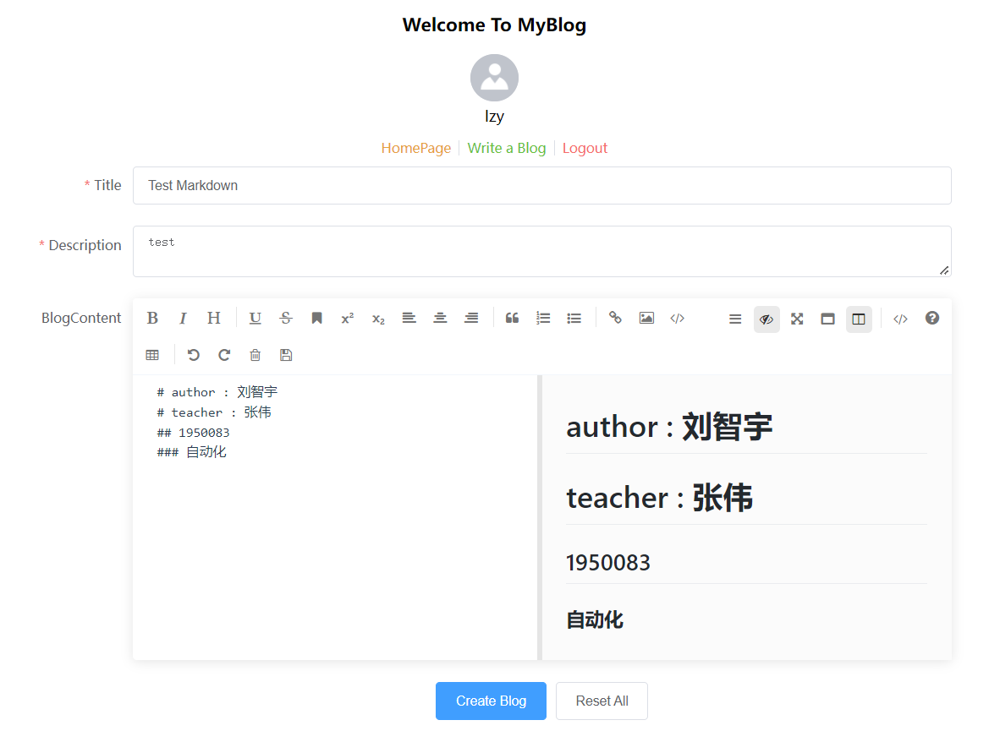
提交反馈
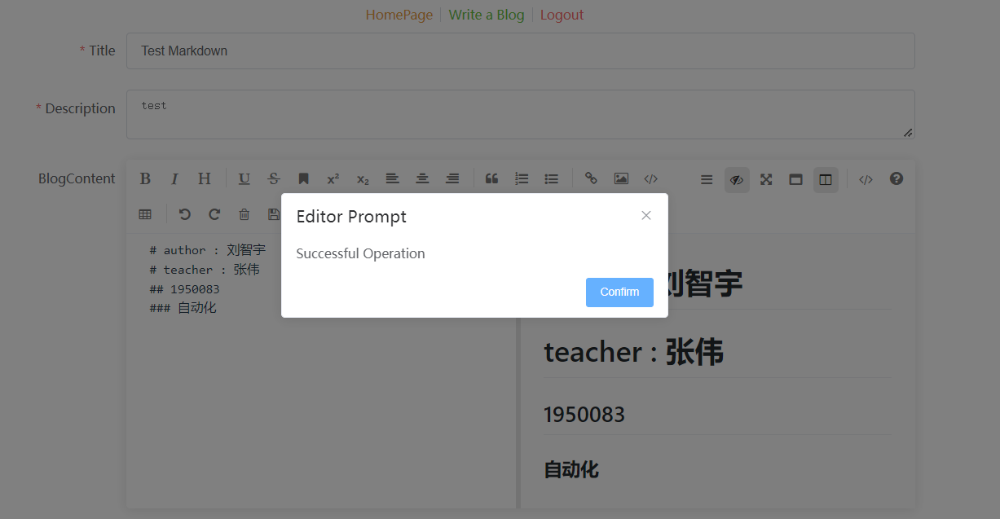
数据库验证
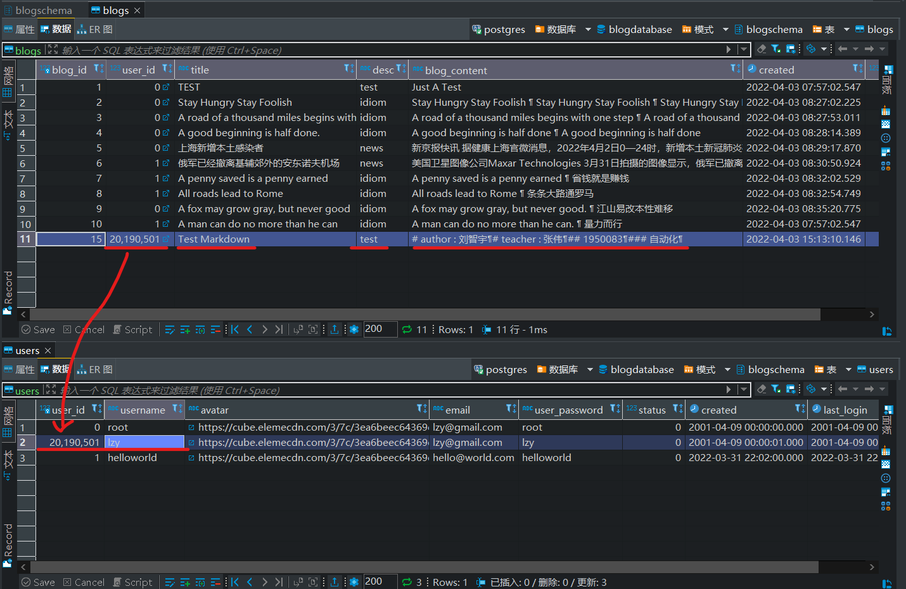
页面跳转后可以看到新的博客（画红线部分）
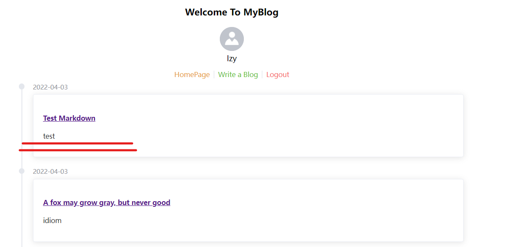
进行编辑和修改（对于之前已经创建的博客，可以看到之前的信息都可以进行显示）
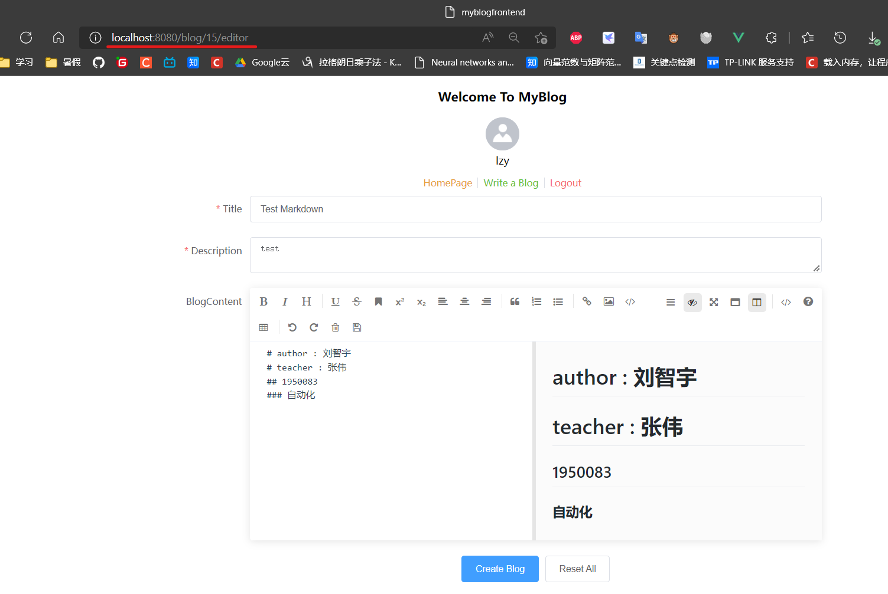


#### 博客详情页开发

博客详情中需要回显博客信息，将博客进行详细的展示。由于，后端传过来的是博客内容是markdown格式的内容，我们需要对其进行渲染然后显示出来，在此使用一个插件markdown-it，用于解析md文档，然后导入github-markdown-c（md的样式）。

在命令行输入两行命令安装插件和md样式
1. **cnpm install markdown-it --save**
2. **cnpm install github-markdown-css**

[Element Border边框组件](https://element.eleme.cn/#/zh-CN/component/border)
[Element Link文字链接](https://element.eleme.cn/#/zh-CN/component/link)

```js
<template>
  <div>
    <Header></Header>

    <div class="my-blog">
      <h2> {{ blog.title }}</h2>

      <!--添加一个编辑按钮，只有博客作者用户能够看到-->
      <el-link icon="el-icon-edit" v-if="ownBlog">
        <!--如果检查到是自己创建的博客，则显示一个可以编辑的链接-->
        <router-link :to="{name: 'BlogEdit', params: {blogId: blog.blogId}}" >
          Edit this Blog
        </router-link>
      </el-link>

      <el-divider></el-divider>  <!--分割线-->
      <!--添加一个markdown-body-->
      <div class="markdown-body" v-html="blog.blogContent"></div>
    </div>
  </div>
</template>
```

**测试**
使用博客作者身份查看博客（可以看到编辑按钮）
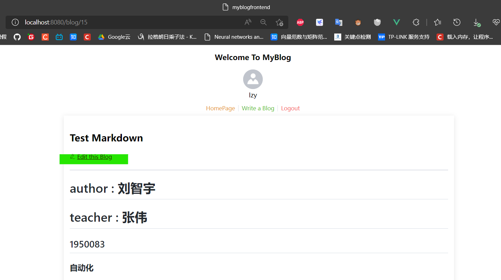
其他人只能进行查看，不能编辑
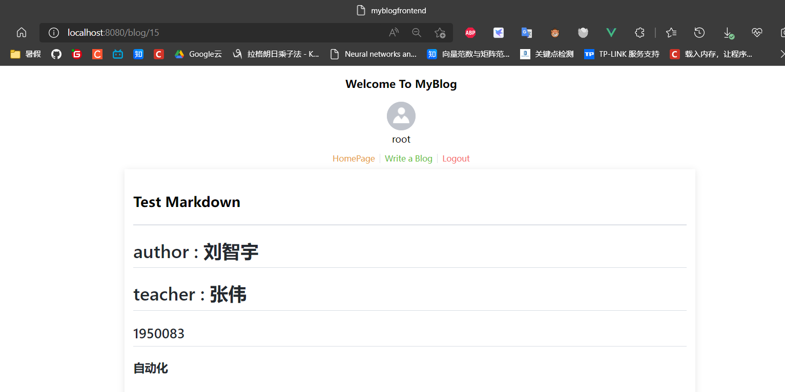


### 路由权限

到此位置，该博客项目基本页面已经开发完毕，还需要判断一下哪些页面是需要登录之后才能跳转的，如果未登录访问就直接重定向到登录页面，也就是路由权限管理。博客的添加和编辑都需要相关权限才能路由。（使用meta进行路由管理）

在router/index.js中，给需要登录才能路由的页面添加meta属性
```js
meta: {
  requireAuth: true
}
```

随后进行路由的前置拦截，在src目录下添加一个permission.js文件（需要在main.js中进行导入：**import "./permission"**）
```js
import router from "./router";
// 路由判断登录 根据路由配置文件的参数
router.beforeEach((to, from, next) => {
  if (to.matched.some(record => record.meta.requireAuth)) { // 判断该路由是否需要登录权限
    const token = localStorage.getItem("token")
    console.log("------------" + token)
    if (token) { // 判断当前的token是否存在 ， 登录存入的token
      if (to.path === '/login') {
        // 有token，当前正在登录界面，什么页不用做
      } else {
        next()
      }
    } else {  // 没有token,跳转到登录界面
      next({
        path: '/login'
      })
    }
  } else {
    next()
  }
})
```
*退出的状态想要通过url进入BlogEditor页面会跳转回Login页面*

<br>
<br>

## 其他

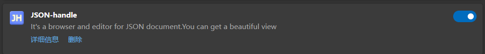

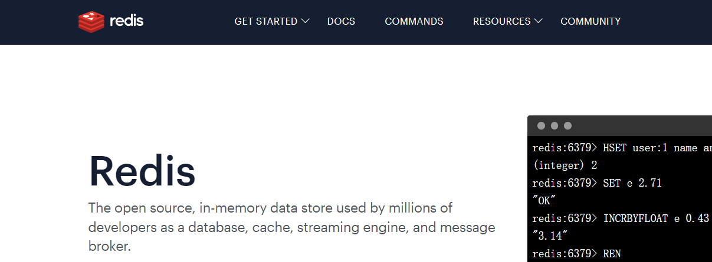


